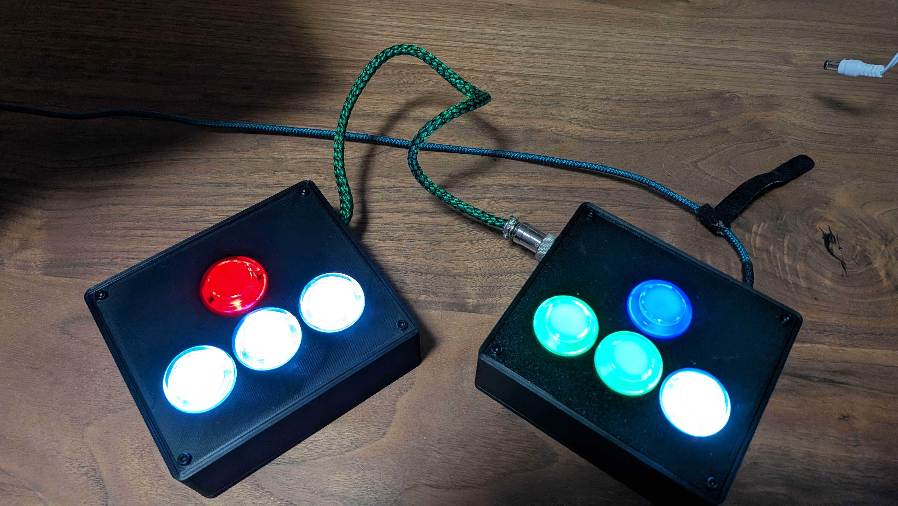

# Tetris Controller

A split Tetris controller built around a Raspberry Pi Pico running CircuitPython. Presents itself as a USB keyboard so it works with any Tetris game (TETR.IO, Tetris Effect, Jstris, etc.) with no remapping required.

## Hardware

- Raspberry Pi Pico (RP2040) — lives in the right half
- 8 buttons, direct-wired (no matrix, no diodes)
- GX16-8 cable connecting the two halves
- LEDs are wired directly to power (no firmware control)

### Wiring

All buttons: **SW+ → GPIO**, **SW− → GND**. Internal pull-ups are enabled in firmware, so LOW = pressed.

| Button       | GPIO | Half  | Key sent      |
|--------------|------|-------|---------------|
| Soft Drop    | GP2  | Left  | Down Arrow    |
| Right        | GP3  | Left  | Right Arrow   |
| Left         | GP4  | Left  | Left Arrow    |
| Hard Drop    | GP5  | Left  | Space         |
| Rotate CCW   | GP6  | Right | Z             |
| Rotate CW    | GP7  | Right | X             |
| Hold         | GP8  | Right | C             |
| Zone / Start | GP9  | Right | A             |

The left-half buttons reach the Pico through the GX16-8 cable but are electrically identical to the right-half buttons.

## Setup for a new Pico

### 1. Flash CircuitPython

1. Download the UF2 for your board:
   - Pico (original / Pico H): <https://circuitpython.org/board/raspberry_pi_pico/>
   - Pico 2: <https://circuitpython.org/board/raspberry_pi_pico2/>
2. Unplug the Pico. Hold the **BOOTSEL** button, then plug it into USB while still holding it.
3. Release BOOTSEL once the `RPI-RP2` drive appears.
4. Drag the `.uf2` file onto `RPI-RP2`. The Pico will reboot and a `CIRCUITPY` drive will appear.

### 2. Install the HID library

1. Download the CircuitPython library bundle matching your CircuitPython version: <https://circuitpython.org/libraries>
2. Unzip it.
3. Copy the `adafruit_hid/` folder from the bundle's `lib/` directory into `CIRCUITPY/lib/`.

That's all the dependencies. Don't bother with the bundle's `requirements/` folder — those are for desktop CPython usage, not for the Pico.

### 3. Copy firmware

Copy `boot.py` and `code.py` from this repo to the root of the `CIRCUITPY` drive.

### 4. Reboot

**Unplug and replug the Pico.** `boot.py` only takes effect on a full power cycle, not on a soft reload — without this step the keyboard HID device won't be registered.

After reboot the controller will appear as a generic USB keyboard. Pressing any button should send the corresponding key.

## Editing the firmware

Files live on the `CIRCUITPY` drive — edit them in place. Any editor works; some good options:

- **Mu Editor** — simplest, has built-in serial console for `print()` debugging.
- **VS Code** with the [CircuitPython v2 extension by wmerkens](https://marketplace.visualstudio.com/items?itemName=wmerkens.vscode-circuitpython-v2) — actively maintained fork of the original Adafruit-recommended extension.
- **Thonny** — also fine, popular in the Pico community.

Changes to `code.py` reload automatically. Changes to `boot.py` need a full unplug/replug.

## Customizing keybindings

Edit the `BUTTONS` table in `code.py`. Available keycodes are listed in `adafruit_hid/keycode.py` (also documented at <https://docs.circuitpython.org/projects/hid/en/latest/api.html>).

## Troubleshooting

- **No `CIRCUITPY` drive after flashing** — try a different USB cable (some are charge-only) or flash the [nuke UF2](https://learn.adafruit.com/getting-started-with-raspberry-pi-pico-circuitpython/troubleshooting) to wipe and start fresh.
- **Keyboard not detected** — make sure you fully unplugged and replugged after copying `boot.py`. A soft reset isn't enough.
- **`ImportError: no module named 'adafruit_hid'`** — confirm `adafruit_hid/` is in `CIRCUITPY/lib/`, not at the root.
- **Stuck keys / missed inputs** — check soldering on the suspect button; debounce is set to 10ms in `code.py` and can be tuned via `DEBOUNCE_SECS`.
